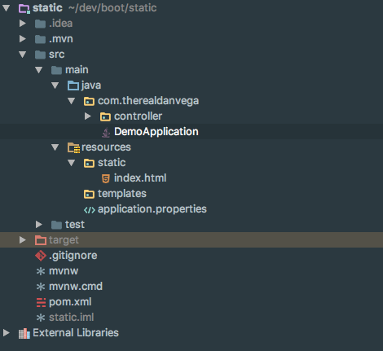

Today we are going to dive into a question from a student of mine. It may seem obvious to some people what is happening but unless you really understand what is going on in the Spring Boot View Layer It can be a little bit confusing.

> Good evening, Mr. Vega. How do you do? My name is Fabio and have a doubt about Spring Boot's behavior. So, I created an index.html file under the static folder (is index.html or any HTML file for that matter what you call a template? Is it just another way to refer to HTML files?) right after importing the project generated by the Initializer and ran the application, with the expected result (the application found and displayed the index). But when I moved on to creating a controller class, with the mapping of the root page, all of a sudden the application couldn't find the HTML anymore, issuing an error message to the console to this effect:  `org.thymeleaf.exceptions.TemplateInputException: Error resolving template "index", the template might not exist or might not be accessible by any of the configured Template Resolvers at org.thymeleaf.TemplateRepository.getTemplate(TemplateRepository.java:246) ~[thymeleaf-2.1.5.RELEASE.jar:2.1.5.RELEASE]`  When I move it to the templates folder, suddenly the application finds it. It's as if when I try without a controller, Spring calls the shots, who looks for it under the static folder; and when I have a controller, it falls to Thymeleaf, who looks for it under templates. What's going on?

## Spring Boot Resources

When you create a brand new Spring Boot Project you will see a resources folder. In that folder, you will have 2 folders (static and templates) that are the subject of this discussion. The static folder is used for static content such as HTML, JavaScript, CSS, Images, etc... The templates folder will be used for template engines to serve dynamic content. 



### Spring Boot Static Content

By default, Spring Boot will serve static content from a directory called  `/static`  (or /public, /resources, /META-INF/resources) in the classpath or from the root of the ServletContext. If you place an index.html in the static folder this will become the homepage for the entire application. 

```html
<html>
<head>
    <title>My Spring Boot Application</title>
</head>
<body>
    <h1>Welcome to my Application</h1>
    <p>This is my default index.html page.</p>
</body>
</html>
```

We don't have to do anything else at all to our application. If we go ahead and run this demo and visit [http://localhost:8080](http://localhost:8080) we should see the following page.  

 If you look in the console you will also see the following log statement. 

```bash
2017-04-26 07:59:07.489  INFO 94384 --- [  restartedMain] oConfiguration$WelcomePageHandlerMapping : Adding welcome page: class path resource [static/index.html]
```

So if we refer back to the students question this is exactly why it worked for him the first time. Also, don't think of this as just a single boring HTML file. As you will see in the coming weeks on this blog you can drop an entire Angular application in that folder if you like and use that as the front-end to your application. 

### Spring Boot Dynamic Content

As well as REST web services, you can also use Spring MVC to serve dynamic HTML content. Spring MVC supports a variety of templating technologies including Thymeleaf, FreeMarker, and JSPs. Many other templating engines also ship their own Spring MVC integrations. Spring Boot includes auto-configuration support for the following templating engines:

*   [FreeMarker](http://freemarker.org/docs/)
*   [Groovy](http://docs.groovy-lang.org/docs/next/html/documentation/template-engines.html#_the_markuptemplateengine)
*   [Thymeleaf](http://www.thymeleaf.org/)
*   [Mustache](https://mustache.github.io/)

When you’re using one of these templating engines with the default configuration, your templates will be picked up automatically from src/main/resources/templates.

#### Spring Boot Controller

If we want to create a controller and add some dynamic content to our home we can do that as well. For this demo, I am going to use Thymeleaf so I have added the appropriate dependency to my pom.xml

```xml
<dependency>
	<groupId>org.springframework.boot</groupId>
	<artifactId>spring-boot-starter-thymeleaf</artifactId>
</dependency>
```

Here we create a controller class and a request mapping for "/". We are going to add a model attribute here called page title that will be pushed down to our view. 

```java
package com.therealdanvega.controller;

// imports

@Controller
public class HomeController {
    @RequestMapping("/")
    public String home(Model model){
        model.addAttribute("pageTitle","Welcome to my Awesome Dynamic Application");
        return "index";
    }
}
```

As you can see from the return statement we are returning index. You don't need to add the HTML file extension here because based on the template engine we use the extension is configured and already known to Spring. This is our Thymeleaf template and should be located in /resources/templates/index.html

```html
<!DOCTYPE html>
<html lang="en"
      xmlns="http://www.w3.org/1999/xhtml"
      xmlns:th="http://www.thymleaf.org">
<head>
    <meta charset="utf-8"/>
    <meta http-equiv="X-UA-Compatible" content="IE=edge"/>
    <meta name="viewport" content="width=device-width, initial-scale=1"/>
    <title>My Spring Boot Application</title>
</head>
<body>
    <h1 th:text="${pageTitle}"></h1>
    <p>This is my Thymeleaf template located at /resources/templates/index.html</p>
</body>
</html>
```

Running the application should produce the following.  


_** Make sure you remove the static HTML file or that will overwrite everything as your home page. _

## Conclusion

This can be pretty confusing, especially to new Spring Boot developers. We can have an index.html file in both the static and templates folders. We just need to think about what type of content we are trying to serve and that might clear things up for everyone.  

_**Question:** What is your favorite view layer technology? _