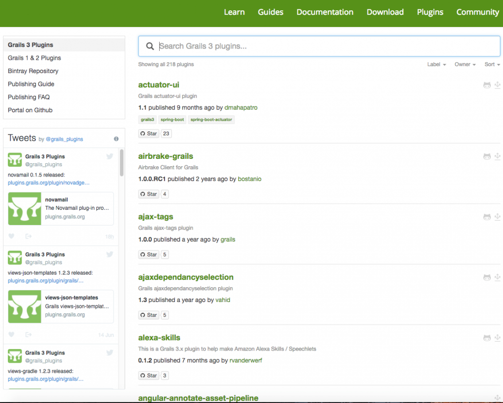
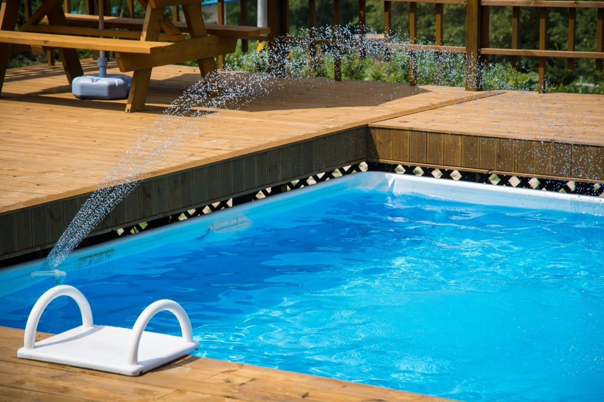

At we work we have a number of huge applications running on Grails 2. When we first heard about the Grails 3 release we couldn't wait to upgrade our applications and then we realized we couldn't. About a year ago our team started to do some investigation into what it would take to upgrade all of our applications. What we quickly found out is that our applications weren't the problem, it was all of the plugins. In this article, we are going to walk through the problems that faced us and I am proud to say that those problems no longer exist today. We are in the middle of upgrading all of our applications at work and I will let you know how we are doing it. 

## Grails Plugins

When I first go into Grails It was the plugin architecture of the framework that really drew me to it. I remember writing the same applications over and over again and having to spend days on boilerplate project code dealing with things like rest, security and data access.  At work, we ended up moving a lot of our projects from ColdFusion over to Groovy & Grails. As I mentioned before about a year ago we decided that we wanted to move all of these applications over to Grails 3.x and ran into some problems. 


Each Grails application is made up a bunch of plugins, some of which are public plugins and some are built in house. In Grails 3 there were a lot of changes to plugins and what this meant is that plugins that were written for Grails 2.x were not going to be compatible with 3.x We knew that all of the in-house plugins were under our control so as long as we wanted to put in the work we could get those moved over. It was all of the public plugins that our applications and even other plugins used. We found out that of the nearly 45-50 plugins that we were using in our applications that maybe 10 of them were compatible. With that, we would have to delay our migration project to Grails 3. 

### Grails 3 Plugins

If you look today there are 218 plugins in Grails 3 which isn't anything near the Grails 2 plugins but it is enough to get you going. All of the major plugins have been updated and I would say 98% of all the plugins that we use have been updated.  



The other thing you have to remember is that Grails 3 now uses Gradle. This means that a lot of actions that might have been in a plugin before can now be moved to Gradle tasks. I know for us we built a code quality plugin in-house that was mainly made up of [CodeNarc](http://codenarc.sourceforge.net/) and [Clover Code Coverage](https://www.atlassian.com/software/clover). There are still no plugins for Grails 3 for either of these but there is a Gradle plugin for Clover and CodeNarc can be moved into a Gradle task.  Grails 3 is also built on Spring Boot which gives us spring boot starters that provide functionality. All of these combined with the new features of Grails 3 means there are some plugins that are no longer needed so don't let the raw number of plugins fool you. 

## Migrate from Grails 2.x to 3.x

I am not going to go through every single step of how to migrate an application. The reason I am not going to is there is a great [step by step migration guide on the Grails website](http://docs.grails.org/3.0.x/guide/upgrading.html) that you can and should check out. Before you go jumping in the deep end and into a migration I thought I would just share a little bit of what I have learned throughout this process with you.  



The first thing you will need to focus on is all of your plugins. I would go through each of your applications and plugins and make a list of all the plugins that you use. I divide these up into public plugins and in-house plugins. You will want to make sure all of the public plugins are supported. If they aren't there are a few questions you can ask yourself:

*   Can we move this functionality to our own plugin? 
*   Is there another plugin that does something similar? 
*   Is there a Gradle task that replaces this?
*   Do we even need a plugin for this? 

In the case of that last question, we had a jQuery and jQuery-UI plugin that were no longer compatible. Since all they really did was include the jQuery libraries we knew that we could just do that manually and actually didn't need a plugin. 

### Grails 3 Plugin

The first step is to create a new Grails 3 plugin using the command line:

```bash
grails create-plugin quartz
```

The next step is to copy the sources from the original Grails 2 plugin to the Grails 3 plugin:

```bash
# first the sources
cp -rf ../quartz-2.x/src/groovy/ src/main/groovy
cp -rf ../quartz-2.x/src/java/ src/main/groovy
cp -rf ../quartz-2.x/grails-app/ grails-app
cp -rf ../quartz-2.x/QuartzGrailsPlugin.groovy src/main/groovy/grails/plugins/quartz
# then the tests
cp -rf ../quartz-2.x/test/unit/\* src/test/groovy
mkdir -p src/integration-test/groovy
cp -rf ../quartz-2.x/test/integration/\* src/integration-test/groovy

# then templates / other resources
cp -rf ../quartz-2.x/src/templates/ src/main/templates
```

While the above will work we realized this wasn't going to work for us. Like most developers, we use source control and if we just straight copy the files we would lose all revision history. If you're using Git this is probably going to be a little bit easier than we had it in Subversion. Either way, this is something you need to be thinking of if keeping that history is important to you.  You will need to add a package declaration to the plugin descriptor. In this case, QuartzGrailsPlugin is modified as follows:

```java
// add package declaration
package grails.plugins.quartz
class QuartzGrailsPlugin {
}
```

The rest of the steps can be found in the Grails Migration guide. Some of them will apply to you and some of them won't. Either way, I would make sure you guy step by step and make sure you do everything that they go through. 

### Grails 3 Application

Now that we have resolved all of our plugins we can move on to migrating our application. Just like the plugins, it is so much easier to create a new Grails 3 application and then move/merge/migrate code over from your Grails 2.x application.  Once the plugins are Grails 3.x compatible you can upgrade the application. To upgrade an application it is again best to create a new Grails 3 application using the "web" profile:

```bash
$ grails create-app myapp
$ cd myapp
```

The next step is to copy the sources from the original Grails 2 application to the Grails 3 application:

```bash
# first the sources
cp -rf ../old_app/src/groovy/ src/main/groovy
cp -rf ../old_app/src/java/ src/main/groovy
cp -rf ../old_app/grails-app/ grails-app
# then the tests
cp -rf ../old_app/test/unit/ src/test/groovy
mkdir -p src/integration-test/groovy
cp -rf ../old_app/test/integration/ src/integration-test/groovy
```

_\* Again I want to point out that if you are using source control this is a step that you really need to think about. _ As I mentioned earlier one of the best additions to Grails 3 is the addition of Gradle. The repositories and dependencies defined in grails-app/conf/BuildConfig.groovy of the original Grails 2.x application will need to be defined in build.gradle of the new Grails 3.x application. We aren't going to go step by step, that can be found in the official documentation but here are the steps remaining. 

*   Modify Package Imports
*   Migrate Configuration
*   Migrate web.xml modifications to Spring
*   Migrate static assets not handled by Asset Pipeline 
*   Migrate Tests

## Resources

The Official Grails Migration Guide that I have mentioned at least 10x in this article is the best resource you have. Outside of that I found 2 really great presentations from GR8Conf Europe 2016 

https://www.youtube.com/watch?v=IhehO9aM5bk 

https://www.youtube.com/watch?v=Qfrp1cbXdVA&t=814s  

## Conclusion

If you looked at migrating in the past but felt you couldn't because of the plugin landscape I think it is about time you gave it another look.  

_**Question:** If you have already migrated what issues did you come across? If you haven't, what are you waiting for? _